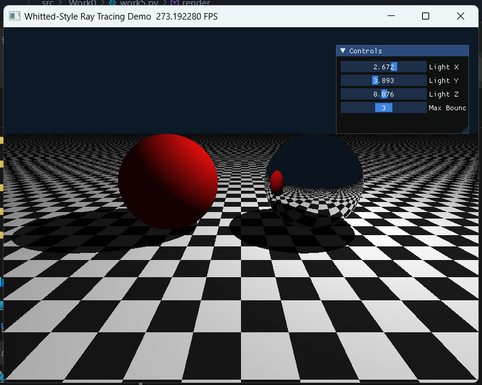
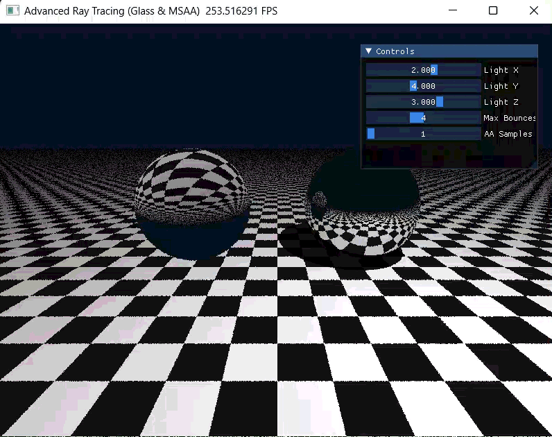

# 计算机图形学实验报告：Whitted-Style 光线追踪与高级材质

## 1. 实验目标
1. **理论理解**：深入理解光线投射（Ray Casting）与光线追踪（Ray Tracing）的本质区别。
2. **全局光照**：掌握如何通过发射次级射线（Secondary Rays）来实现硬阴影（Hard Shadows）、理想镜面反射（Perfect Reflection）以及玻璃材质的折射与全反射。
3. **GPU 编程思维**：学习如何利用 Taichi 框架，将传统的递归光线追踪算法改写为适合 GPU 并行计算的迭代（循环）模式。
4. **画质提升**：理解并实现多重采样抗锯齿（MSAA）技术，消除走样边缘。

---

## 2. 实验原理

### 2.1 Whitted-Style 光线追踪模型
当一条主光线（Primary Ray）从摄像机出发击中物体表面时，根据材质的不同进行分支处理：
* **漫反射（Diffuse）**：按 Lambertian/Phong 模型计算颜色，并向光源方向发射一条“暗影射线”。如果该射线在到达光源前击中了其他物体，则该点处于阴影中，仅保留环境光；随后**终止**该条光线的传播。
* **理想镜面（Mirror）**：根据反射定律计算反射方向，生成一条新的反射射线继续在场景中传播。

### 2.2 斯涅尔定律（Snell's Law）与全反射
对于玻璃等透明材质，光线在介质交界处会发生折射。根据折射率（IOR）计算透射光线方向。当光线从光密介质射向光疏介质，且入射角大于临界角时，会发生**全反射（Total Internal Reflection, TIR）**，此时不再有折射光线出射，按照纯镜面反射处理。

### 2.3 多重采样抗锯齿（MSAA）
由于屏幕像素是离散的网格，仅在像素中心进行单次采样会导致物体边缘出现阶梯状的“锯齿”。MSAA 通过在一个像素的几何范围内引入随机偏移（如使用 `ti.random()`），发射多条光线进行采样，最后将所有采样的颜色值进行平均，从而实现平滑的边缘过渡。

---

## 3. 实验内容与步骤

### 3.1 基础任务实现：场景搭建与光线弹射
我们在 Taichi Kernel 中隐式定义了无限大黑白棋盘格平面、红色漫反射球和银色镜面球。为了适应 GPU 架构，使用 `for` 循环代替了递归函数，通过更新射线起点 `ro` 和方向 `rd`，并引入颜色吞吐量 `throughput` 来实现光路的多次弹射。

**核心避坑点（Shadow Acne 消除）**：
在计算反射射线和暗影射线时，必须将射线起点沿着法线方向向外偏移一个极小值（如 $10^{-4}$）：
$$\mathbf{P}_{new} = \mathbf{P} + \mathbf{N} \times \epsilon$$
否则射线会与自身表面立刻相交，产生满屏的黑色噪点。

实验同时接入了 `ti.ui.Window`，实现了动态控制光源位置和最大弹射次数的交互面板。以下是基础光线追踪任务的渲染结果：

### 3.2 附加任务实现：玻璃材质与抗锯齿
在基础任务之上，我们将左侧的红球替换为了折射率为 1.5 的玻璃材质。通过计算入射光线与法线的点乘（判断光线是从空气进入玻璃还是从玻璃射出），动态调整相对折射率和法线方向。

同时，引入了 `spp` (Samples Per Pixel) 变量控制抗锯齿采样率。当采样率为 1 时，物体边缘存在明显的锯齿；当采样率提升后，不仅边缘变得平滑，玻璃内部的折射噪点也得到了显著改善。

*注：以下为不同采样率下的画面表现对比。*

**关闭抗锯齿（采样数 = 1）：**
可以看出球体边缘有明显的像素阶梯感。

**开启抗锯齿（采样数 = 16）：**
经过像素内 16 次随机抖动采样并求均值后，边缘实现了非常柔和的过渡，画质大幅提升。

---

## 4. 遇到的问题及解决方案

1. **Taichi 数学库 API 版本差异**
   * **问题描述**：运行时提示 `AttributeError: module 'taichi.math' has no attribute 'abs'`。
   * **解决方案**：在当前使用的 Taichi 1.7.4 版本中，部分基础数学函数不再挂载于 `ti.math` 下。将代码中所有的 `ti.math.abs`, `ti.math.sqrt`, `ti.math.max` 等直接替换为 `ti.abs`, `ti.sqrt`, `ti.max` 后编译通过。
2. **LLVM 编译阶段的类型断言失败**
   * **问题描述**：抛出 `Assertion failed: castIsValid(op, S, Ty)` 错误。
   * **解决方案**：在使用 `@ti.func` 返回多个变量（包含标量和 `ti.Vector`）时，如果使用下划线 `_` 占位符去接收向量返回值，会导致 Taichi 静态类型推导混乱。将占位符 `_, _, _` 改为具体的显式变量名（如 `dummy_p, dummy_n, dummy_c`）后，问题完美解决。

---

## 5. 实验总结
本次实验从零搭建了一个基于 GPU 硬件加速的光线追踪器。通过将经典的递归算法转化为迭代循环，深刻体会到了并行计算在图形学中的威力。在解决 Shadow Acne 和类型推断报错的过程中，增强了对底层图形学原理和 Taichi 框架的理解。附加的玻璃材质和 MSAA 实现，进一步证明了基于物理的渲染（PBR）在提升画面真实感方面的巨大潜力。
